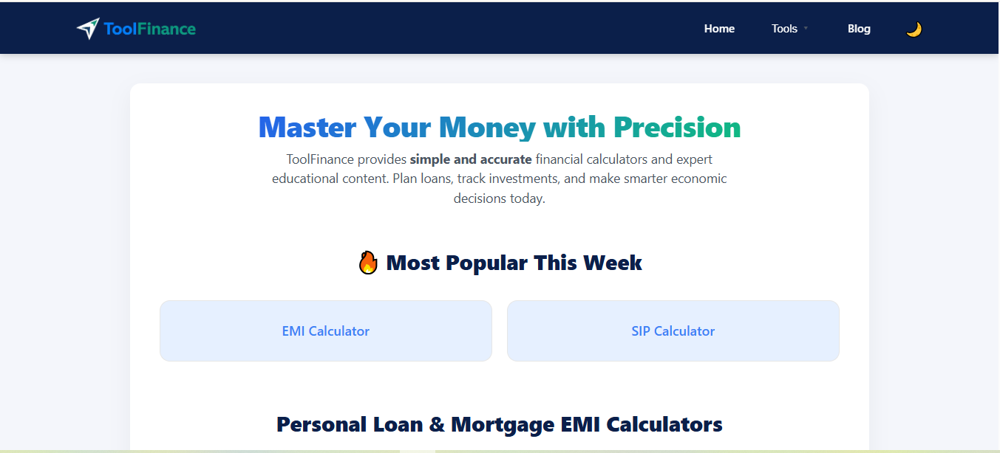
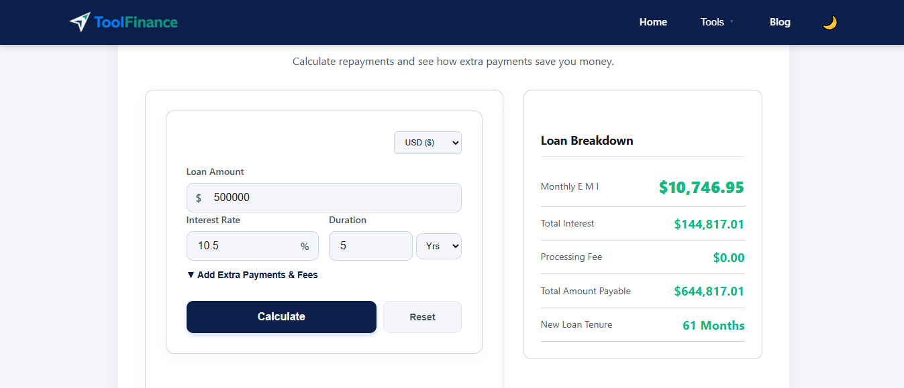

Project Structure:
```
fintools
├─ components
│  ├─ ads
│  │  └─ AdPlaceholder.js
│  ├─ calculator
│  │  ├─ CalculatorForm.js
│  │  ├─ CalculatorInput.js
│  │  └─ ResultBox.js
│  ├─ layout
│  │  ├─ Footer.js
│  │  ├─ Header.js
│  │  ├─ ThemeToggle.js
│  │  └─ ToolSEO.js
│  └─ ui
│     └─ ToolCard.js
├─ context
│  └─ CurrencyContext.js
├─ data
│  ├─ articles
│  │  ├─ digital.js
│  │  ├─ foundation.js
│  │  ├─ index.js
│  │  ├─ markets.js
│  │  ├─ protection.js
│  │  ├─ systems.js
│  │  └─ wealth.js
│  ├─ tool-guides
│  │  ├─ index.js
│  │  ├─ investment.js
│  │  ├─ loan-emi.js
│  │  ├─ stock-business.js
│  │  └─ tax-quick.js
│  └─ tools.js
├─ next.config.js
├─ package-lock.json
├─ package.json
├─ pages
│  ├─ about.js
│  ├─ api
│  │  └─ sitemap.js
│  ├─ blog
│  │  ├─ category
│  │  │  └─ [id].js
│  │  ├─ index.js
│  │  ├─ news.js
│  │  └─ [slug].js
│  ├─ contact.js
│  ├─ disclaimer.js
│  ├─ index.js
│  ├─ privacy-policy.js
│  ├─ terms.js
│  ├─ tools
│  │  ├─ break-even.js
│  │  ├─ compound-interest.js
│  │  ├─ credit-card-payoff.js
│  │  ├─ currency.js
│  │  ├─ dividend-yield.js
│  │  ├─ emi.js
│  │  ├─ fd-rd-calculator.js
│  │  ├─ fd.js
│  │  ├─ fuel.js
│  │  ├─ gst-vat-tax.js
│  │  ├─ home-loan-vs-rent.js
│  │  ├─ income-tax.js
│  │  ├─ inflation.js
│  │  ├─ loan-eligibility.js
│  │  ├─ loan.js
│  │  ├─ lumpsum.js
│  │  ├─ margin-markup.js
│  │  ├─ mortgage.js
│  │  ├─ net-worth.js
│  │  ├─ ppf-nps-calculator.js
│  │  ├─ retirement.js
│  │  ├─ savings-goal.js
│  │  ├─ simple-interest.js
│  │  ├─ sip.js
│  │  └─ stock-average.js
│  ├─ _app.js
│  └─ _document.js
├─ public
│  ├─ google703b14412bfda3ec.html
│  ├─ icon.png
│  ├─ images
│  │  ├─ 2026-inflation-squeeze.webp
│  │  ├─ 50-30-20-rule-pie-chart.webp
│  │  ├─ aca-coverage-loss-2026.webp
│  │  ├─ ai-agent-economy.webp
│  │  ├─ ai-energy-supercycle.webp
│  │  ├─ ai-finance-superapp.webp
│  │  ├─ ai-productivity-shock-labor-market.webp
│  │  ├─ asset-location-strategy.webp
│  │  ├─ australia-data-center-2026.webp
│  │  ├─ automated-finance-engine.webp
│  │  ├─ automated-finance-system.webp
│  │  ├─ bolt-ryan-breslow-restructure.webp
│  │  ├─ brazil-desenrola-2026.webp
│  │  ├─ cbdc-financial-privacy-hero.webp
│  │  ├─ cbdc-privacy-architecture.webp
│  │  ├─ cbdc-vs-bitcoin-comparison.webp
│  │  ├─ central-bank-gold-buying-2026.webp
│  │  ├─ compound-interest-growth.webp
│  │  ├─ de-dollarization-global-markets.webp
│  │  ├─ depin-infrastructure-economy.webp
│  │  ├─ dfw-ground-stop-risk.webp
│  │  ├─ digital-legacy-protection.webp
│  │  ├─ dunkin-free-coffee-bounty.webp
│  │  ├─ emerging-markets-wealth-strategy.webp
│  │  ├─ emi-chart.JPG
│  │  ├─ emi-prepayment-impact.webp
│  │  ├─ epfo-upi-withdrawal-2026.webp
│  │  ├─ family-office-strategy.webp
│  │  ├─ fd-returns-vs-market-index.webp
│  │  ├─ fed-meeting-april-2026.webp
│  │  ├─ financial-planning.webp
│  │  ├─ finlogo.png
│  │  ├─ flixtrain-germany-2026.webp
│  │  ├─ global-currency-reserve-trends.webp
│  │  ├─ global-debt-wall-2027.webp
│  │  ├─ global-green-bonds.webp
│  │  ├─ global-reserve-shift.webp
│  │  ├─ grow_your_wealth.webp
│  │  ├─ gst-vat-chart.JPG
│  │  ├─ india-green-bonds-systems.webp
│  │  ├─ india-rtgs-banking-systems.webp
│  │  ├─ india-rtgs-flow-2026.webp
│  │  ├─ india-tax-act-2025-systems.webp
│  │  ├─ india-tax-reform-2026.webp
│  │  ├─ india-tax-section-mapping-2026.webp
│  │  ├─ india-uli-lending.webp
│  │  ├─ inflation-basics.webp
│  │  ├─ inflation-vs-equity-returns-chart.webp
│  │  ├─ karpathy-software-3-anthropic.webp
│  │  ├─ liquidity-mirage-fragility.webp
│  │  ├─ liquidity-trap-2026.webp
│  │  ├─ loan-guide.webp
│  │  ├─ loan-guidee.png
│  │  ├─ loan-types-chart.JPG
│  │  ├─ money-psychology-2026.webp
│  │  ├─ net-worth-balance-sheet.webp
│  │  ├─ nvidia-earnings-may-2026.webp
│  │  ├─ passive_income.webp
│  │  ├─ path-to-graph.webp
│  │  ├─ perpetual-wealth-engine.webp
│  │  ├─ placeholder-dollar-vs-sp500.webp
│  │  ├─ placeholder-forex-tug-of-war.webp
│  │  ├─ quantum-security-finance.webp
│  │  ├─ red-lobster-closing-tallahassee.webp
│  │  ├─ rtgs-liquidity-mirroring.webp
│  │  ├─ rule-of-72-comparison-chart.webp
│  │  ├─ rule-of-72-compounding.webp
│  │  ├─ solana-india-2026.webp
│  │  ├─ sustainable-wealth-blueprint.webp
│  │  ├─ traditional-banking-vs-digital-assets.webp
│  │  ├─ vix-spike-august-2024.webp
│  │  ├─ wealth-velocity-trap.webp
│  │  ├─ wealthcreation.webp
│  │  ├─ yen-carry-trade-collapse.webp
│  │  └─ yield-curve-shift-2026.webp
│  ├─ og-image.png
│  ├─ robots.txt
│  └─ site.webmanifest
├─ README.md
├─ styles
│  ├─ base
│  │  ├─ typography.css
│  │  └─ variables.css
│  ├─ components
│  │  ├─ blog.css
│  │  ├─ calculator.css
│  │  ├─ footer.css
│  │  ├─ header.css
│  │  ├─ home-blog.css
│  │  ├─ tool-overrides.css
│  │  ├─ tool-overrides2.css
│  │  └─ ui-elements.css
│  ├─ globals.css
│  ├─ Home.module.css
│  └─ layout
│     └─ container.css
└─ utils
   └─ formatters.js

```

# Finance-tools


A modern financial platform built with **Next.js**, providing practical financial calculators, educational resources, and market insights.

**✨ 25+ Financial Calculators • 📚 Finance Knowledge Center • ⚡ SEO Optimized • 📱 Fully Responsive**

---

## 🚀 About the Project

Finance-tools is a fast, responsive web application designed to simplify personal finance and financial planning. It offers a collection of financial calculators, educational articles, and market analysis within a clean, mobile-friendly interface.

The platform is available without requiring user registration and allows users to quickly perform financial calculations such as loan repayments, investment growth, retirement planning, tax estimation, and wealth analysis while also exploring educational content covering core financial concepts and global economic developments.

---

## 🛠️ Tech Stack

* **Framework:** Next.js (React)
* **Language:** JavaScript (ES6+)
* **Styling:** Modular CSS Architecture with reusable components and responsive design
* **State Management:** React Hooks & Context API
* **Deployment:** Vercel

---

## ✨ Features

### 📊 Financial Calculators

More than **25 interactive financial calculators**, including:

* EMI Calculator
* Mortgage Calculator
* SIP Calculator
* Compound Interest Calculator
* Income Tax Calculator
* Retirement Planner
* Loan Eligibility Calculator
* Net Worth Calculator
* Credit Card Payoff Calculator
* Stock Average Calculator
* and many more.

---

### 📚 Financial Knowledge Center

A dynamic article system organized into six major categories:

* Financial Foundations
* Wealth Management
* Global Markets
* Risk & Protection
* Digital Economy
* Financial Systems & News

The platform combines practical calculators with educational content to help users better understand personal finance and economic trends.

---

### 📱 Responsive User Experience

* Mobile-first responsive layout
* Optimized navigation for desktop and mobile
* Reusable component architecture
* Fast page loading
* Clean and accessible interface

---

### 🔍 SEO & Performance

Built with search engine optimization and performance in mind.

Features include:

* Server-side rendering (SSR) and static generation (SSG)
* Dynamic XML sitemap generation
* JSON-LD structured data
* Open Graph metadata
* Canonical URLs
* Semantic HTML
* Optimized images (WebP)

---

## 📁 Project Structure

```text
Finance-tools/
├── components/
├── context/
├── data/
├── pages/
├── public/
├── screenshots/
├── styles/
├── utils/
├── README.md
├── package.json
└── next.config.js
```

---

## 🚀 Getting Started

Clone the repository:

```bash
git clone https://github.com/Sawbean/Finance-tools.git
```

Install dependencies:

```bash
npm install
```

Start the development server:

```bash
npm run dev
```

## 🌐 Live Demo

🔗 **Live Website**

https://finance-tools-mu.vercel.app/


---

## 📸 Screenshots

| Home | Financial Tools |
|------|-----------------|
|  |  |

| Blog | Articles |
|------|----------|
|  |  |

---

## 🎯 Project Goals

* Build a comprehensive financial toolkit
* Provide free and accessible financial education
* Deliver accurate financial calculations
* Maintain excellent SEO and performance
* Continuously expand calculators and educational content

---

## 🔮 Planned Features

* Additional financial calculators
* More educational guides
* Improved data visualization
* Advanced comparison tools
* Performance optimizations
* Continued UI/UX improvements

---

## 🤝 Contributing

Contributions, suggestions, and bug reports are welcome.

If you'd like to contribute, feel free to open an issue or submit a pull request.

---

## 📄 License

This project is licensed under the license specified in this repository.
